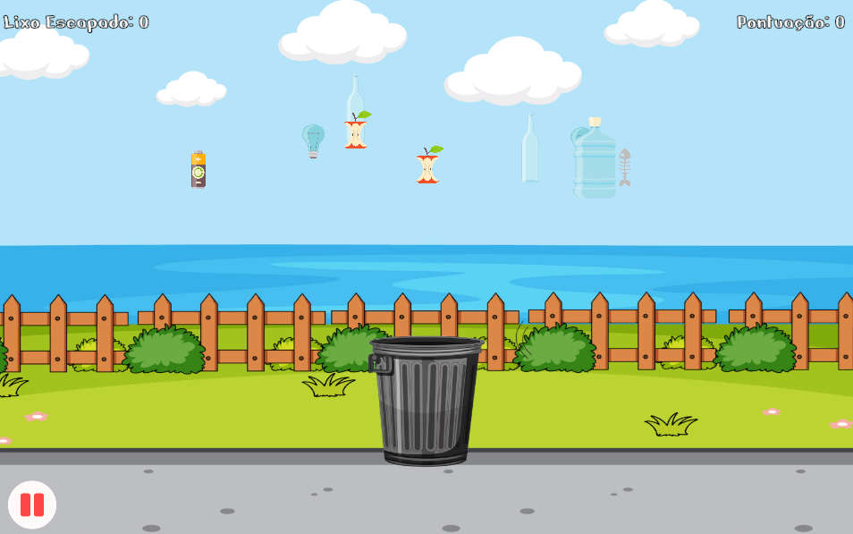

# Eco Coleta de Lixo

**Eco Coleta de Lixo** é um jogo 2D simples e educativo onde os jogadores controlam uma lixeira para coletar o lixo que cai do topo da tela. O objetivo é evitar que o lixo ultrapasse a tela, enquanto coleta o máximo possível para aumentar sua pontuação.

## Funcionalidades

- **Coleta de Lixo:** Os jogadores controlam uma lixeira que se move horizontalmente para coletar sacos de lixo que caem do topo da tela.
- **Contador de Lixo Escapado:** O jogo rastreia quantos sacos de lixo escapam sem serem coletados.
- **Game Over:** O jogo termina quando 10 sacos de lixo escapam pela tela.
- **Sistema de Pontuação:** O jogador ganha pontos para cada saco de lixo coletado.
- **Funcionalidade de Pausa:** O jogo pode ser pausado a qualquer momento, interrompendo a queda dos sacos de lixo.
- **UI Responsiva:** A interface do jogo se adapta a diferentes tamanhos de tela.

## Visualização do Jogo

  

## Como Jogar

- Use as teclas de **seta esquerda/direita** ou as teclas **A** e **D** para mover a lixeira.
- **Colete** os sacos de lixo movendo a lixeira sob eles enquanto caem.
- Se um saco de lixo escapar pela parte inferior da tela, ele será contabilizado como **"Lixo Escapado"**.
- O jogo termina quando **10 sacos de lixo** escapam.
- A pontuação do jogador e a quantidade de lixo escapado são exibidas no topo da tela.
- Pressione o botão **pausar** (canto inferior esquerdo) para parar o jogo.

Para jogar, basta acessar o link: [https://luan-calasans.github.io/Eco/](https://luan-calasans.github.io/Eco/)

## Estrutura do Projeto

- **Assets**: Contém todos os ativos do jogo, incluindo sprites, sons e scripts.
    - **Fonts**: Fontes personalizadas usadas para o texto da interface do usuário.
    - **Images**: Sprites e imagens usados no jogo.
    - **Prefabs**: Objetos do jogo pré-fabricados, como a lixeira e os sacos de lixo.
    - **Scripts**: Scripts C# que gerenciam a lógica do jogo.
    - **Scenes**: Diferentes cenas do jogo (Início, Jogo e Tutorial).
    - **Sounds**: Arquivos de áudio para efeitos do jogo, como sons de coleta e música de fundo.
    - **TextMeshPro**: Componentes de texto personalizados usados para os contadores de pontuação e lixo escapado.
  
- **Scripts**: Contém todos os scripts C# que gerenciam o comportamento do jogo.
    - **`TrashEngine.cs`**: Gerencia as mecânicas do jogo, incluindo cálculo de pontuação e condições de fim de jogo.
    - **`TrashMovement.cs`**: Controla o movimento de queda dos sacos de lixo.
    - **`EscapedTrashCounter.cs`**: Rastreia e exibe a quantidade de sacos de lixo que escaparam.
    - **`TrashSpawner.cs`**: Gera sacos de lixo em posições aleatórias na tela em intervalos regulares.
    - **`PauseMenu.cs`**: Lida com a funcionalidade de pausa do jogo.
    - **`SceneSwitcher.cs`**: Permite que o jogador troque entre diferentes cenas do jogo (como o menu inicial e o tutorial).
    - **`QuitApplication.cs`**: Lida com a funcionalidade de sair do jogo (em WebGL, solicita que o jogador feche a aba).
